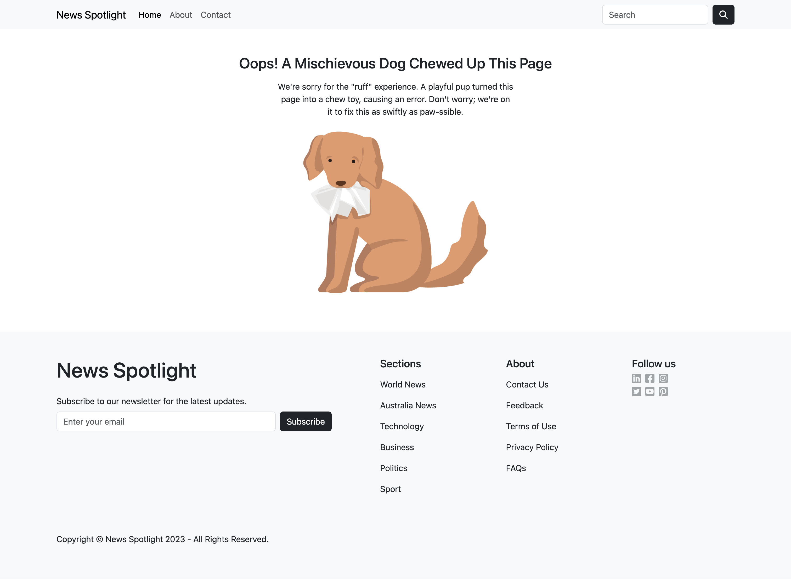

# News Summary Challenge

## Overview

Welcome to the News Summary Challenge! This project is designed to help you summarize news articles effectively. Follow the steps below to get started:

## Getting Started

1. Clone this repository to your local machine.

2. Navigate to the project's root directory and install the necessary dependencies by running the following command:
   ```sh
   $ npm install
   ```

3. Run the tests using the following command:
   ```sh
   $ npm test
   ```

## Object Oriented Design

Below is a table detailing the responsibilities and relationships of each component and file used in this project:

| Component/File       | Responsibilities                                                 | Relationship                                                    |
| -------------------- | ---------------------------------------------------------------- | --------------------------------------------------------------- |
| App                  | Sets up routing and manages the state of the articles            | Requires Header, Footer, HeadlinesPage, ArticleSummaryPage & ErrorPage |
| Header               | Renders the navigation bar                                        | Used in App                                                     |
| Footer               | Renders the footer content                                        | Used in App                                                     |
| HeadlinesPage        | Renders the list of latest news articles                          | Used in App & requires ArticleCard                              |
| ArticleCard          | Renders a single article with a link to the article summary page | Used in App & requires ArticleDateAndWriter, articleData        |
| ArticleDateAndWriter | Renders the article's date and writer                             | Used in App & requires articleData                              |
| ArticleSummaryPage   | Renders the information for a specific article                   | Used in App & requires articleData                              |
| ErrorPage            | Displays an error message/page when a page is not found          | Used in App                                                     |
| articleData          | Fetches article data from the API                                 | Used in App                                                     |

## Tests

### getArticles Tests:

1. **Test for External Data Call:** This test ensures that the `getArticles` function makes an external data call to fetch articles and verifies that it calls `axios.get` with the correct API URL.

2. **Test for Successful Request:** The test verifies that the `getArticles` function returns the correct data from the API response when the request is successful and ensures that it returns the expected data.

3. **Test for Unsuccessful Request:** This test checks if the `getArticles` function handles unsuccessful requests and returns an error object when an error occurs during the data fetch. It validates that the function returns the error object in such cases.

### Article Summary Page Tests:

1. **Test for Article Rendering:** This test ensures that the Article Summary page is rendered with the details of a specific article and checks if the correct article is displayed based on the provided article data.

2. **Test for Invalid Article ID:** The test checks if the Article Summary page navigates to the Error Page when attempting to view an article with an invalid ID.

## Website Preview
Below are some images that show how the website looks like:




## Credits
- [Bootstrap Documentation](https://getbootstrap.com/docs/5.3/getting-started/introduction/)
- [React BrowserRouter](https://reactrouter.com/en/main/router-components/browser-router)
- [Testing Library Cheatsheet](https://testing-library.com/docs/react-testing-library/cheatsheet)
- [Understanding createMemoryRouter](https://reactrouter.com/en/main/routers/create-memory-router)
- [Understanding React hooks](https://medium.com/weekly-webtips/react-hooks-101-83dc72a4cb69)
- [Kapwing 404 Illustrations](https://www.kapwing.com/404-illustrations)
